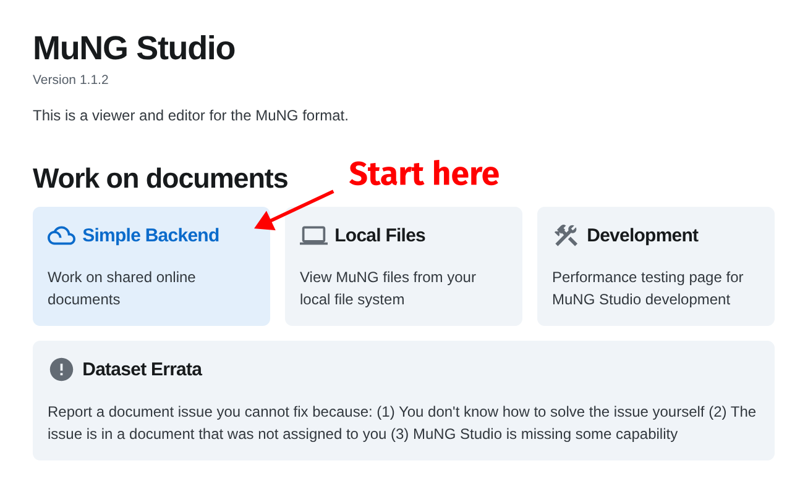

# MuNG Studio User Manual

This document teaches you how to use the MuNG Studio annotation tool.

- [Openning a document](#openning-a-document)
- [Overview](#overview)
- [Document saving](#document-saving)
- [Basic controls](#basic-controls)
    - [Moving the viewport](#moving-the-viewport)
    - [Scene rendering options](#scene-rendering-options)
    - [Toolbelt overview](#toolbelt-overview)
    - [Selecting nodes](#selecting-nodes)
    - [Class-based node visibility options](#class-based-node-visibility-options)
- [Annotating masks](#annotating-masks)
    - [Creating new node](#creating-new-node)
    - [Modifying existing node mask](#modifying-existing-node-mask)
    - [Changing existing node class](#changing-existing-node-class)
    - [Deleting a node](#changing-existing-node-class)
- Annotating notation graph
    - ...

## Openning a document

MuNG Studio is deployed at this address:

> **MuNG Studio:** https://ufallab.ms.mff.cuni.cz/~mayer/mung-studio/

When you first open MuNG Studio, you can choose from a number of document sources (e.g. documents on your device). In this user manual I assume you are an annotator on some project and so your documents will live in the *Simple Backend* source. You have likely received an access token for the *Simple Backend* via email from the project administrator. To open a document, start by clicking on the *Simple Backend* card:

<blockquote></blockquote>

In the *Simple Backend*, enter your token and save it. The token will be stored in your web browser, so you won't need to re-insert it the next time you come. You will see a list of all the documents we have collectively annotated (or are still working on).

<blockquote></blockquote>

At the beginning of the list, there are documents whose name start with `-0- ...`. These are test documents you can open and play with. If you destroy them, no problem, that's what they are intended for.

<blockquote></blockquote>

Click on a document to open it. It will open in a new tab of the browser, so you can have more than one document open at one time.

## Overview

MuNG Studio consists of three panels:

- Overview Panel (left)
- Scene View (center)
- Inspector Panel (right)

<blockquote></blockquote>

The *Overview Panel* displays information about the whole document. It lets you control symbol visibility and rendering modes.

The *Scene View* is used to explore and annotate the document. At the bottom of the scene view there is the *Toolbelt* which lets you select various annotation tools. Clicking on objects in the *Scene View* with the default *Pointer Tool* lets you select nodes.

> **Note:** One symbol/object is called a *node*, since it's a node of the notation graph.

The *Inspector Panel* displays detailed information and controls regarding your current context. It changes based on the selected nodes and tool. When empty, it also displays tips on how to use the current tool.

## Document saving

The open document is saved automatically in the background. If you were to close MuNG Studio with unsaved changes, a dialog will open asking you to wait a little for the save to complete.

> **Warning:** Currently, there is no mechanism to resolve one document being open by multiple people. When that happens, the last person to save wins and overwrites the document. Therefore it is important that you only EDIT your own documents. But you can freely VIEW any documents.

MuNG Studio automatically creates backups of individual documents, so in case of a disaster, we can manually recover. Just let the administrators know about the issue. The backup is created each day at midnight, so during a disaster, all changes on that day will be lost.

## Basic controls

### Moving the viewport

We'll start by learning how to move the viewport.

**Move with touchpad:** Place two fingers on your touchpad and move them around. The *Scene View* will move accordingly.

<blockquote></blockquote>

**Move with mouse:** Press down the <kbd>🖱️ Mouse Wheel</kbd> to grab the *Scene View* and move the mouse around. The *Scene View* will move accordingly.

<blockquote></blockquote>

**Zooming:** Hold <kbd>Ctrl</kbd> or <kbd>Command ⌘</kbd> and scroll up/down with the <kbd>🖱️ Mouse Wheel</kbd> or two-finger/edge scrolling on touchpad. The *Scene View* will zoom in/out.

<blockquote></blockquote>

**Scrolling:** When scrolling with the <kbd>🖱️ Mouse Wheel</kbd> or the touchpad, the *Scene View* will move up/down. Hold <kbd>Shift</kbd> to move sideways instead.

**The hand tool:** You can pick up the *Hand Tool* by pressing <kbd>H</kbd>. Then you can click-and-drag the *Scene View* around. You can exit the *Hand Tool* by pressing <kbd>V</kbd> (picking back up the *Pointer Tool*).

### Scene rendering options

In the *Overview Panel* on the left, there are options that control the way, nodes are rendered in the *Scene View*:

<blockquote></blockquote>

The first three buttons control the rendering of nodes. It consists of three modes:

- **Bounding boxes:** Runs fast even on slow hardware, masks are not visible.
- **Masks:** (default) Masks are visible, may be slow when viewing the whole page.
- **Invisible:** Nodes are completely hidden.

<blockquote>
    
    
    
</blockquote>

By default, use the *Masks* option to easily spot mistakes with mask annotations. Only when MuNG Studio is slow on your device, choose the other two options.

The second set of buttons controls *Notation Graph* link visibility. You can toggle <kbd>🔴 syntax</kbd> and <kbd>🟢 precedence</kbd> links independently:

<blockquote>
    
    
    
</blockquote>

You can toggle these on/off to aid readability of the *Scene View*.

### Toolbelt overview

At the bottom of the *Scene View* there is the *Toolbelt* with the following tools:

- Cursor <kbd>V</kbd>, selecting objects
- Hand <kbd>H</kbd>, moving the screen disabled interactions with the scene
- Node editing <kbd>N</kbd>, creating and modifying nodes
- Syntax links <kbd>L</kbd>, annotating syntax links
- Precedence links <kbd>P</kbd>, annotating precedence links

<blockquote></blockquote>

The *Cursor* and *Hand* tools are meant for exploring the document, selecting nodes and performing basic operations (deleting nodes, toggling individual edges).

The *Node Editing* tool is more explored in the [Annotating masks](#annotating-masks) section. It is used to create and update nodes.

The *Syntax Links* and *Precedence Links* tools are very similar and both are intended for fast insertion of the respective link types. These should be used when annotating *Notation Graph* links from scratch for a new document. They are more explored in the [Annotating links](#annotating-links) section.

### Selecting nodes

Make sure you have the *Pointer Tool* (<kbd>V</kbd> key).

When you click on a node (<kbd>Left Mouse Button</kbd>), it becomes selected. When you click on it again, it deselects.

Click on the background to deselect nodes. You can also press the <kbd>Esc</kbd> key.

You can select multiple nodes by holding the <kbd>Shift</kbd> key and clicking. Clicking on an already selected node removes it from the selection.

Alternate way to select multiple nodes is to drag-select a rectangular area. Click and hold, and move the mouse to select multiple nodes. All nodes touching the rectangle will become selected.

This method selects all nodes if there are many nodes on top of one another. It is one of the ways to select a lower node, obstructed by an upper node - select both by dragging and then deselect the top one with <kbd>Shift</kbd> + click.

### Class-based node visibility options

TODO ...

## Annotating masks

### Creating new node

1. Select the *Node Editing Tool* (`[N]` key).
2. Click on the screen to create polygon (left mouse button).
3. Once the polygon is done, commit the polygon by pressing `[N]` or `[Enter]`.
4. Close the *Node Editing Tool* by pressing `[N]` again.

The class used for the node is shown in the *Inspector Panel* on the right. You can change the value and it will be remembered for future nodes to be created.

### Modifying existing node mask

1. Select the node.
2. Enter the *Node Editing Tool* (`[N]` key).

Now you can add polygons to the mask by repeatedly drawing a polygon and committing it. You can erase a polygon using the polygon erase tool. Drawing and erasing can be toggled by pressing `[T]`.

You can remove the last polygon point by clicking with the right mouse button.

You can cancel a partial polygon by pressing `[Esc]` key.

You can also exit the Node Editing tool by pressing `[Esc]`.

### Changing existing node class

1. Select the node
2. Enter the *Node Editing Tool* (`[N]` key).
3. In the *Inspector Panel* (right, up) change the node class (submit with enter)
4. Exit the *Node Editing Tool* via `[Esc]` or `[N]`.

### Deleting a node

Select a node and then press the `[Del]` key.

## Annotating links

TODO
